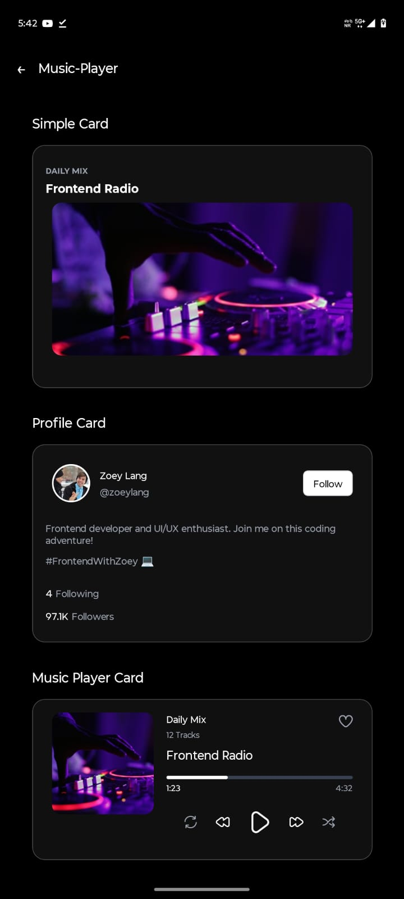
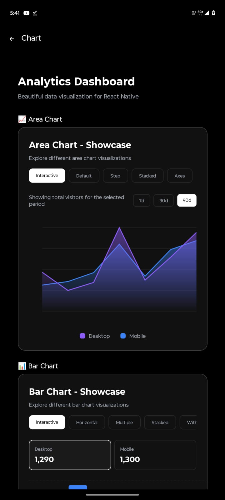
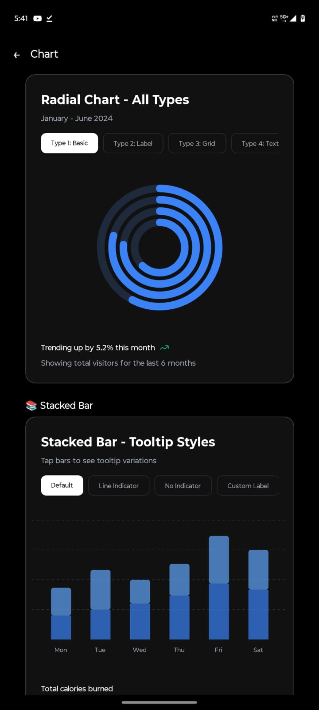
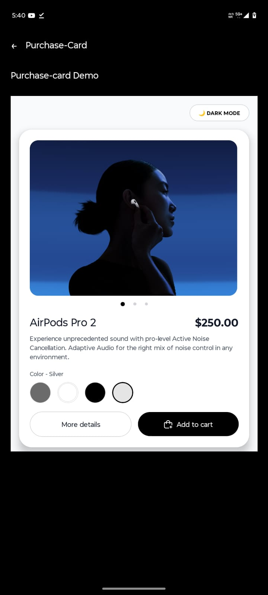
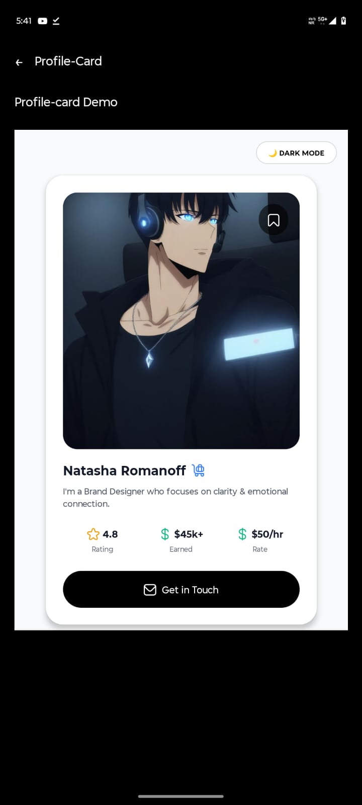

# KROS UI

> **shadcn/ui for React Native CLI** — copy, paste, and own beautifully crafted components for iOS & Android.

[](./LICENSE)
[](https://reactnative.dev)
[](#)
[](#-roadmap)

KROS UI is a free, open-source collection of production-ready React Native components, built for **React Native CLI** (no Expo). There is no package to `npm install` — you copy a component's source file straight into your project and own the code from that point on. No black-box dependency, no version lock-in, full control to customize.

---

## Table of Contents

- [Preview](#-preview)
- [Why KROS UI](#-why-kros-ui)
- [Components](#-components)
- [Requirements](#-requirements)
- [Quick Start](#-quick-start-run-the-demo-app)
- [Using a Component in Your Own App](#-using-a-component-in-your-own-app)
- [Style System — applyTw](#-style-system--applytw)
- [Poppins Fonts](#-poppins-fonts)
- [Theme System](#-theme-system)
- [Project Structure](#-project-structure)
- [Available Scripts](#-available-scripts)
- [Troubleshooting](#-troubleshooting)
- [Contributing](#-contributing)
- [License](#-license)

---

## 📸 Preview

<p align="center">
  
  
  
  
  
</p>

---

## ✨ Why KROS UI?

| Feature | Description |
|---|---|
| 📋 **Copy & Paste** | Like shadcn/ui — no package to install, just copy the component file into your project |
| 🎨 **Tailwind-style Classes** | Style with `applyTw('flex-1 bg-black text-white')` instead of `StyleSheet.create` |
| 🅿️ **Poppins Fonts** | All 18 Poppins weight/style variants pre-linked and ready to use |
| 🌗 **Dark / Light Theme** | Built-in `ThemeProvider` + `useTheme()` hook with toggle support |
| 📱 **iOS & Android** | Every component tested on both platforms |
| 🚫 **No Expo** | Pure React Native CLI — no Expo SDK, no managed workflow |
| ⚡ **Zero config** | Drop the file in, import it, done — no plugin or babel setup required for the components themselves |

---

## 📦 Components

~65 components live under [src/components/ui](./src/components/ui). Most are done; a handful are still being polished.

<details open>
<summary><strong>✅ Available now</strong></summary>

Accordion · Alert · Alert Dialog · AI Input · Article · Aspect Ratio · Avatar · Badge · Breadcrumb · Button · Button Group · Calendar · Card · Carousel · Chart · Checkbox · Data Table · Date Picker · Dialog · Drawer · Dropdown Menu · Empty · Field · Form · Hover Card · Input · Input Group · Input OTP · Item · Kbd · Label · Menubar · Music Player · Popover · Progress · Profile Card · Purchase Card · Radio Group · Spinner · Streaming · Switch · Table · Tabs · Text · Textarea

</details>

<details>
<summary><strong>🔄 In progress</strong></summary>

Navigation Menu · Pagination · Resizable · Scroll Area · Select · Separator · Sheet · Sidebar · Skeleton · Slider · Sonner · Toast · Toggle · Toggle Group · Tooltip

</details>

> Browse every component live in the included demo app (`HomeScreen` → `ComponentDemo`) before copying it into your project.

---

## ✅ Requirements

- Node.js `>= 18`
- A working [React Native CLI environment](https://reactnative.dev/docs/set-up-your-environment) — Xcode for iOS, Android Studio/SDK for Android
- Ruby + [Bundler](https://bundler.io/) (for CocoaPods, iOS only) — see the included [Gemfile](./Gemfile)
- This project does **not** use Expo. If your app was created with Expo, `applyTw` and the components will still work, but you'll need to eject or use a bare/dev-client workflow to install native dependencies like `react-native-reanimated`.

---

## 🚀 Quick Start (run the demo app)

Use these steps if you want to clone this repo and run the component showcase app locally.

### 1. Clone the repository

```bash
git clone https://github.com/StrTux/KROS-UI.git
cd KROS-UI
```

### 2. Install dependencies

```bash
npm install
```

### 3. Link font assets

```bash
npm run link-assets
```

### 4. iOS only — install CocoaPods

```bash
bundle install
cd ios && bundle exec pod install && cd ..
```

### 5. Run the app

```bash
# Metro bundler (run in its own terminal, optional — android/ios will start it automatically)
npm start

# Android
npm run android

# iOS
npm run ios
```

---

## 🧩 Using a Component in Your Own App

KROS UI is **not an npm package** — you copy the files you need directly into your own React Native CLI project.

### Step 1 — Copy the style engine

`applyTw` powers every component's styling. Copy the whole `style/` folder (it contains the Tailwind-to-RN engine, responsive scaling, and theme tokens) into your project:

```
your-app/
└── src/
    └── style/
        ├── _elst.js          ← applyTw, colors, spacing
        ├── _responsive.js
        ├── theme.js
        ├── core/
        ├── responsive/
        ├── themes/
        └── tokens/
```

### Step 2 — Copy the component(s) you want

For example, to use `Button`, copy `src/components/ui/button.js` into your project:

```
your-app/
└── src/
    └── components/
        └── ui/
            └── button.js   ← paste here
```

Some components import shared helpers — check the top of the file you're copying for relative imports like `./text`, `../../functions/iconUtils`, or `../../style/_elst`, and copy those along with it.

### Step 3 — Use the component

```jsx
import { Button } from './src/components/ui/button';

// Basic usage
<Button variant="default" onPress={() => console.log('pressed')}>
  Click Me
</Button>

// With icon
<Button variant="outline" icon={<MyIcon />} iconPosition="left">
  Download
</Button>

// Loading state
<Button variant="default" loading>
  Processing...
</Button>

// Disabled
<Button variant="destructive" disabled>
  Unavailable
</Button>
```

---

## 🎨 Style System — `applyTw`

KROS UI ships a custom Tailwind-to-React-Native utility called `applyTw`, so you can style components the way you would with Tailwind CSS on the web.

```jsx
import { applyTw } from './src/style/_elst';

// Replaces StyleSheet.create()
<View style={applyTw('flex-1 bg-black px-4 py-6')}>
  <Text style={applyTw('text-white text-xl font-bold')}>
    Hello KROS UI
  </Text>
</View>
```

### Supported classes

| Category | Examples |
|---|---|
| Layout | `flex-1`, `flex-row`, `items-center`, `justify-between` |
| Spacing | `p-4`, `px-6`, `py-2`, `m-3`, `mt-4`, `gap-2` |
| Typography | `text-sm`, `text-xl`, `font-bold`, `font-semibold`, `text-center` |
| Colors | `bg-black`, `text-white`, `bg-gray-900`, `text-red-500` |
| Borders | `border`, `border-2`, `rounded-lg`, `rounded-full` |
| Sizing | `w-full`, `h-10`, `w-1/2`, `h-screen` |
| Position | `absolute`, `relative`, `top-0`, `right-4` |
| Transforms | `scale-110`, `rotate-45`, `translate-x-4`, `skew-x-3` |
| Shadows | `shadow`, `shadow-lg`, `shadow-blue-500` |
| Arbitrary values | `bg-[#1a1a1a]`, `h-[48px]`, `w-[80%]`, `text-[#ffffff]/50` |
| Opacity | `opacity-50`, `bg-black/30` |

Also exported from `src/style/_elst.js`:

- `mergeTw(...classes)` — merge/conditionally combine class strings
- `withClassName(Component)` — wrap any component so it accepts a `className` prop instead of `style`
- `registerTwUtility` / `registerTwUtilities` — register your own custom utility classes at runtime

---

## 🅿️ Poppins Fonts

All 18 Poppins variants are pre-linked and available as utility classes:

```jsx
<Text style={applyTw('font-thin')}>Thin (100)</Text>
<Text style={applyTw('font-light')}>Light (300)</Text>
<Text style={applyTw('font-normal')}>Regular (400)</Text>
<Text style={applyTw('font-medium')}>Medium (500)</Text>
<Text style={applyTw('font-semibold')}>SemiBold (600)</Text>
<Text style={applyTw('font-bold')}>Bold (700)</Text>
<Text style={applyTw('font-extrabold')}>ExtraBold (800)</Text>
<Text style={applyTw('font-black')}>Black (900)</Text>
```

Italic variants (`Poppins-Italic`, `Poppins-MediumItalic`, etc.) are also linked — combine with `italic` / `not-italic` classes as needed. Run `npm run link-assets` after copying `src/assest/font` into your own project so the native build picks up the font files.

---

## 🌗 Theme System

Wrap your app in `ThemeProvider` and read/toggle theme anywhere with `useTheme()`:

```jsx
// App.js
import { ThemeProvider } from './src/style/theme';

export default function App() {
  return (
    <ThemeProvider>
      {/* your app */}
    </ThemeProvider>
  );
}

// In any component
import { useTheme } from './src/style/theme';

const MyComponent = () => {
  const { theme, currentTheme, toggleTheme } = useTheme();

  return (
    <View style={{ backgroundColor: currentTheme.background }}>
      <Text style={{ color: currentTheme.text.primary }}>
        Current: {theme}
      </Text>
      <Button onPress={toggleTheme}>Toggle Theme</Button>
    </View>
  );
};
```

---

## 📁 Project Structure

```
KROS-UI/
├── android/, ios/        # Native RN CLI projects
├── src/
│   ├── assest/
│   │   ├── font/         # Poppins font files (.ttf)
│   │   └── icon/         # Flaticon icon font
│   ├── components/
│   │   └── ui/           # All UI components
│   │       ├── index.js  # Central exports
│   │       ├── button.js
│   │       ├── card.js
│   │       └── ...
│   ├── data/              # Static demo data (e.g. videos.json)
│   ├── functions/
│   │   ├── _fn.js         # Utility helpers
│   │   ├── _router.js     # Simple screen router
│   │   └── iconUtils.js   # Icon rendering helpers
│   ├── screen/
│   │   ├── HomeScreen.js       # Component showcase list
│   │   └── ComponentDemo.js    # Individual component demo
│   └── style/
│       ├── _elst.js       # applyTw — Tailwind-to-RN style engine
│       ├── _responsive.js # Responsive scaling helpers
│       ├── theme.js        # Dark/light theme context
│       ├── core/           # applyTw runtime + custom utility registry
│       ├── responsive/     # Device/viewport context
│       ├── themes/         # Theme runtime
│       └── tokens/         # Semantic design tokens
├── App.js                 # Demo app entry point
└── index.js                # RN entry point (registers App)
```

---

## 📜 Available Scripts

```bash
npm start              # Start Metro bundler
npm run android        # Run the demo app on Android
npm run ios            # Run the demo app on iOS
npm test               # Run Jest tests
npm run lint           # Run ESLint
npm run link-assets    # Link Poppins font & icon assets (react-native-asset)
```

---

## 🔧 Core Dependencies

```json
{
  "react": "18.2.0",
  "react-native": "0.74.3",
  "react-native-reanimated": "~3.10.1",
  "react-native-safe-area-context": "^4.14.1",
  "react-native-linear-gradient": "^2.8.3",
  "react-native-svg": "^14.2.0",
  "react-native-video": "^6.18.0",
  "react-native-webview": "^13.16.0",
  "@react-native-community/slider": "^5.1.1",
  "class-variance-authority": "^0.7.1",
  "date-fns": "^3.0.0"
}
```

You only need to add the dependencies used by the specific component(s) you copy — check each component's imports to see what it relies on.

---

## 🛠 Troubleshooting

- **"Tailwind class not found" warning in the console** — `applyTw` logs unrecognized class names instead of throwing. Double-check the class name against the [supported classes](#supported-classes) table, or register it with `registerTwUtility`.
- **Fonts not showing after copying components** — make sure you ran `npm run link-assets` (or manually linked `src/assest/font`) and did a full rebuild (`npm run android` / `npm run ios`), not just a Metro reload.
- **iOS build fails after `pod install`** — make sure you ran `bundle install` first; this repo pins CocoaPods via the [Gemfile](./Gemfile).
- **Component throws on import** — some components depend on siblings (e.g. `button.js` imports `./text` and `../../functions/iconUtils`). Copy the full dependency chain, not just the one file.

---

## 🤝 Contributing

Contributions are welcome! Please read [CONTRIBUTING.md](./CONTRIBUTING.md) before submitting a PR.

### To add a new component:

1. Create `src/components/ui/your-component.js`
2. Export the component + a `YourComponentDemo` default export
3. Register it in `src/components/ui/index.js`
4. Add it to the list in `src/screen/HomeScreen.js`
5. Add it to `COMPONENT_MAP` in `src/screen/ComponentDemo.js`

See [GUID.md](./GUID.md) for the full step-by-step component development guide.

---

## 📄 License

MIT © KROS UI Contributors — see [LICENSE](./LICENSE) for details.

---

## ⭐ Support

If KROS UI helps your project, consider giving it a ⭐ on GitHub — it genuinely helps others discover it.

> **Status**: 🚧 Active development — most core components are done, a handful of overlay/layout primitives are still in progress. See [Components](#-components) for the current breakdown.
